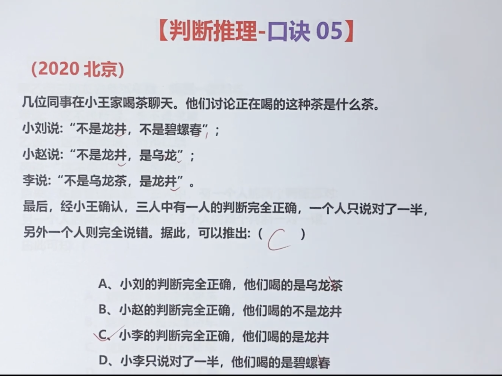
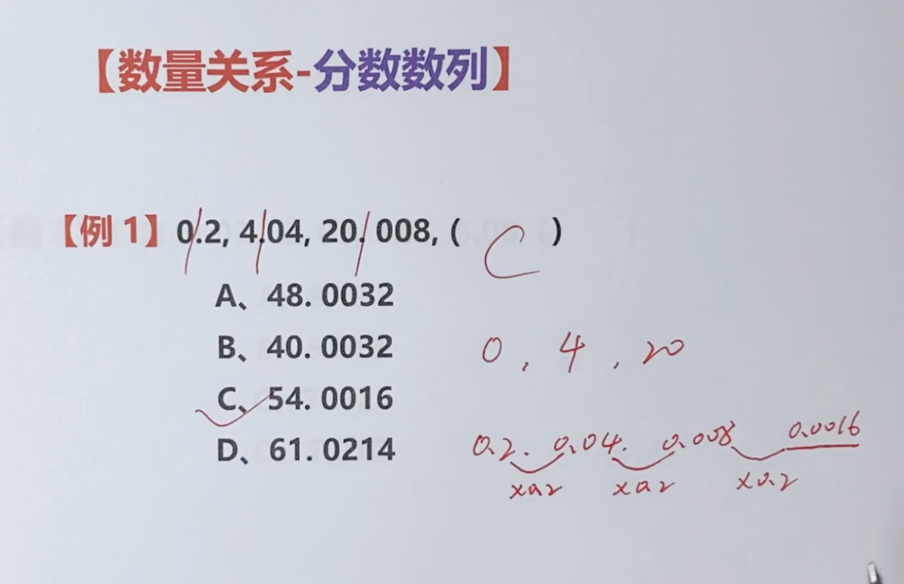

[TOC]

# 一、判断推理

## 1 真假推理

### 口诀1：找矛盾 看其他

矛盾关系必有一真一假

矛盾关系：

A和非A、所有都是和有的不是、所有都不是和有的是

## 2 两真两假题型

### 口诀2：找矛盾 看其他 或（至少）为真

## 3 3+2题型

### 口诀3：找相同 相同归大 做排除

通常是五个人，三个人怎么样，两个人怎么样

## 4 4+3+2+1 题型

### 口诀4：用3找不同、用2找（不同人的）队友、队友是答案

题目最后4人中3人怎么样2人怎么样1人怎么样

## 5 一人全对、一人全错、一人一对一错题型

### 口诀5：找出现次数最多为答案为真

为真：只能是不能不是

## 6 每个人都只猜对了一半题型

### 口诀6：找出现次数最少为答案

题目最后出现猜测都只猜对了一半字眼

多个主体，按主题分类，也满足上述条件，例如甲乙丙在abc公司工作、人甲出现最少、公司a出现最少，两个出现的猜测地方都是对的

## 7 数据排序

### 口诀7：最大信息 排除 比大小

最大信息:出现频率最高

题目出现 按……从（大）到（小） 排列

## 8 数据拆分

### 口诀8： 大大得大

题目出现 a大于b，c大于d

## 9 互换物品

### 口诀9：两两不能互换

画个三角形

题目出现：拿的是一个人的，背的是另一个人的。相同物品不能放同一个人的情况

## 10 3推1

### 口诀10：唯我独尊（别人都挂了，我是，你们都不能是）

龙椅只有一个，三个人争，一个人坐上去的前提是另外两个人挂了

题目出现，a和b都没有考上，c就考上了。要得出……结论，需要……前提

## 11 两个有的（欺软）

### 口诀11： 找到点名那句，反着他说，人称变所有

题目出现，a说有的，b说有的，c说 某某是，只有**一人说的是真**的。

## 12 两个所有 (怕硬)

### 口诀12：找到点名那句，顺着他说，人称变所有

题目出现，a说所有的，b说所有的，c说 某某是，只有**一人说的是假的***。

## 13 三段论

### 口诀13：两个有的 一个所有 去同存异 前在前 后在后

题干出现：有的有的所有（3缺一），问以下哪项为真才能**支持上述论证成立**

两个有的一个所有缺哪个补哪个

## 14 定义题选非

### 口诀14：同构做排除

# 二 加强削弱

## 推出关系：

### 前推后：

如果……那么……

若……则……

只要……就……

### 后推前：

只有……才……

除非……否则不……

加强削弱有强度之分，题干出现最能加强，最能反驳等要注意

## 解题思路

## 加强方式

## 削弱方式

## 推测类论证

### 个体推个体

狗推人： 加强：二者相似，削弱：二者不相似

### 局部推整体

抽样推整体：加强：样本典型，削弱：样本不典型

## 推出型论证

假如题干出现：A->B

最强削弱：A且-B

**-A且B没有反驳作用，也就是最不能反驳**

## 比例类的加强削弱

加强削弱类题目，凡是涉及百分数的，正确选项往往也涉及到百分数

## 根本原因型加强削弱

下列题型3

## 1 对比实验型

### 口诀1：论点加强、咱俩一样

题目中分组做实验，题干出现：增加(补充)前提、支持结论、加强结论等

## 2 对比试验型

### 口诀2：论点削弱，咱俩不一样

题干出现：质疑、反驳、削弱字眼

## 3 题干吵架型-削弱反对者观点

### 口诀3：削弱反对者观点,A导致B

题干：不是A是B导致了效果 

选项：A导致B

## 4 翻译类搭桥

### 口诀4：去同存异

题干：

​	论据 A->B,

​	论点A->C

选项：加强 B->C   （当A->B时，满足B->C 方可推出 A->C）

题干：

​	论据 A->B,

​	论点C->B

选项：加强 C->A   （满足C->A时，当A->B时，才可推出C->B）

## 5 举措有效型-没你更好

### 口诀5：题干：A有效果 选项：没A更有效果

可见、据此、然而、但是这些字眼后即是论点

## 6 举措无效型-没你更差

### 口诀6：题干：A没有效果 选项：没A会更没有效果

## 7 因果倒置型

### 口诀7：题干：论点A->B,选项：B->A

题目出现：研究表明、研究发现、调查已知、调查发现等是论点，论点中有因果关系

## 8 普通型加强

### 口诀8：搭桥：论据A->论点B

找出论据论点，相连

# 三 数量关系

**（凡是需要列方程一步步解就输了，不如不做）**

## 1 分数数列

### 口诀1：看上不看下、看下不看上、还是不会就通分

## 2 小数数列

### 口诀2：看左不看右、看右不看左

能看小数点左边得出规律的就不用看右边了

## 3 倍数特性

### 口诀3：（1）题干找比例关系（2）看特殊数字

（1）比例关系：几比几、百分比、几分之几、几倍注意化为最简分数

（2）看特殊数字：算份数 选项里面找倍数

## 4 奇偶特性

### 口诀4：知和求差，和差同性（反之亦然）

#### 1：求不定方程

#### 2：知和求差

#### 3：知差求和

加减法：两奇或两偶->偶， 一奇一偶->奇

乘法：一偶和任意数->偶，奇奇相乘->奇

两数之和为偶，两数之差也为偶

两数之和为奇，两数只差也为奇

## 5 概率问题

### 口诀5：求：A和B在一起的概率 代入A再看B

## 6 日期问题-星期几

### 口诀6：差一年+1 闰年再+1 关注日期

已知某年某天的星期数，求另年这天的星期数

## 7 日期问题

### 口诀7：大月前三后三 小月前二后二

大月：前三天和后三天星期数是一样的   

小月（2月不是小月是平月）：前两天和后两天星期数是一样的

## 8 鸡兔同笼

### 口诀8：假设都是B 总差/个差=A

## 9 四牛过河

### 口诀10： 先排序 再相乘（1301） 最后相加

最少用多少时间

## 10 五牛过河

### 口诀10：先排序 再相乘（23101） 最后相加

## 11 面积最大值

### 口诀11：已知a&b的和为定值，当a=b时（a&b数量最接近时）a*b的值最大

## 12 溶液问题

### 口诀12：十字交叉法

溶液、平均值求某方人数

## 13 行程问题（一）

### 口诀13：单岸型公式 S = (3S1+S2)/2

题干：相向而行，第一次相遇（距其中一端S1）、第二次相遇（距其中一端S2），求东西两岸的距离(S)

## 14 行程问题（二）

### 口诀14：双岸型公式 S = (3S1-S2)

题干：相向而行，第一次相遇（距其中一端S1）、第二次相遇（距其中另一端S2），求东西两岸的距离(S)

## 15 选项特征

### 口诀15：题干见倍数 选项找倍数 ， 题干见和差 选项找和差

#### 倍数

#### 和差

## 16 最值问题（一）

### 口诀16：题干【最不利构造：至少+保证】  答案： 最倒霉+1

## 17 最值问题（二）

### 口诀17：构造数列   1编号（从大到小） 2求谁设谁 3列方程

**把M项分成N项** 是最值问题中的构造数列问题

## 18 最值问题（三）

### 口诀18：反向构造  正面=总量-反面的和（反向-求和-做差）

题目出现多个集合，并让计算所有集合条件都满足的元素至少有几个

要让共同借鉴的最少，则都没有借过的要最多（3人没借过的书没有重合）

## 19 最值问题（补充题型）

### 平均值才能保证相同的最少，或者总量不变，一方变少，肯定有一方增加

## 20 特值思维

最小公倍数

# 四 类比推理 

## 1 类比推理（种属关系）

### 口诀1：种属关系看泛特

泛指和特指

题目：什么是什么的一种

## 2 类比推理（词性：动词名词形容词近义词反义词）

### 口诀2：词语拆分看词性 （动词名词形容词）

### 口诀2： 常用词语看词性 （动词名词形容词）

## 3 类比推理（顺序关系）

### 口诀3：顺序关系看主体

## 4 类比推理（因果关系）

### 口诀4：因果关系看人自 

人工和自然

## 5 类比推理（职业身份）

### 口诀5：职业身份看工资

学生是一种身份，厨师拿钱是一种职业

## 6 类比推理（文学常识）

### 口诀6：历史典故看主客 

主体和客体

## 7 类比推理（原材料）

### 口诀7：原材料要看物化

物理变化和化学变化

没有新的物质产生是物理变化

## 8 类比推理（功能对应）

### 口诀8：功能关系看主次

主要功能和次要功能

## 9 类比推理（属性）

### 口诀9：属性关系看必或

必然和或然，一定有的是必然，有的是或然

## 10 类比推理（场所）

### 口诀10：场所关系看唯一

是不是只能出现在该场所

