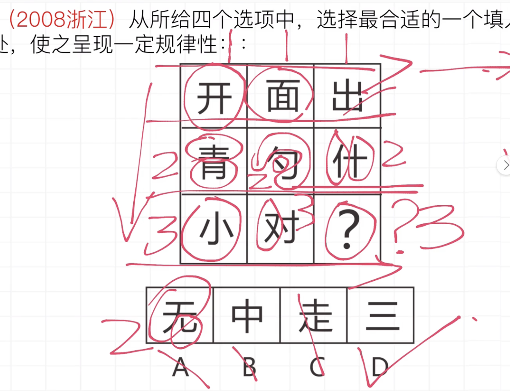

[TOC]

# 五、图形推理

元素组成相同，优先考虑位置规律

## 1 黑白球(常考对称和笔画)

### 口诀：平移、对称性、笔画数、部分数、黑白运算、面积（平移部分笔画运算对称面积）

#### 类型：平移（数目相同）

#### 类型：对称性

#### 类型：笔画

#### 类型：部分数 （黑白分割成n部分）

#### 类型：黑白运算（九宫格和两组找规律）

## 2 汉字

### 口诀：封闭、部分、结构、笔画、拼音、遍历、去同存异（封闭部分拼音笔画结构）

#### 部分

#### 结构（半包围）

#### 笔画

#### 拼音

#### 遍历

#### 去同存异

## 3 字母类

### 口诀：对称、封闭、曲直、顺序

#### 曲直

#### 顺序

#### 书写习惯（顺逆时针）

## 4 数量类

### 口诀

#### 点（线条数量相交明显）

#### 特殊点（直直交点、直曲交点、曲曲交点、内部图形和外部框）

**内部交点**

**直线与曲线交点**

## 5 位置类

### 口诀：平移、翻转、旋转

#### 平移

#### 旋转

