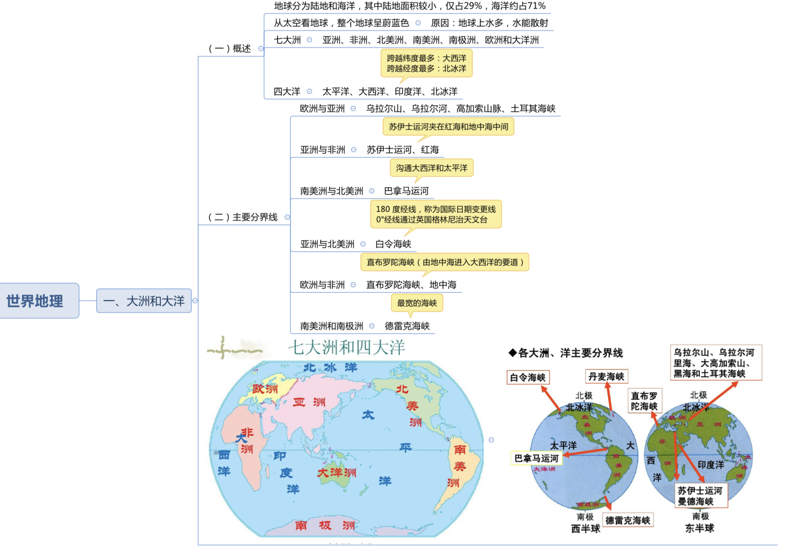
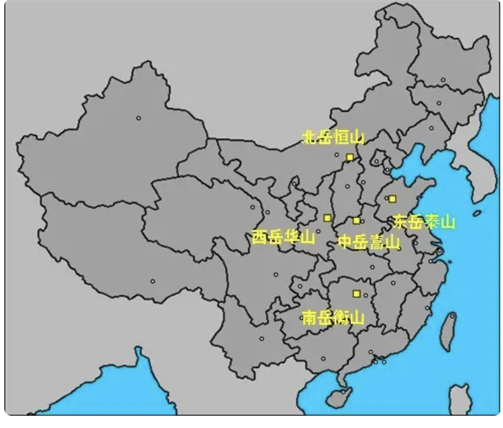

[TOC]

# 常识

## 1 闰年

```
四年一闰，百年不闰, 四百年再闰
```

## 2 十二花名歌

```
正月山茶满盆开，
二月迎春初开放。
三月桃花红十里，
四月牡丹国色香。
五月石榴红似火，
六月荷花满池塘。
七月茉莉花如雪，
八月桂花满枝香。
九月菊花姿百态，
十月芙蓉正上妆。
冬月水仙案上供，
腊月寒梅斗冰霜。
```

3 朝代歌

```
三皇五帝始，尧舜禹相传。
夏商与西周，东周分两段。
春秋和战国，一统秦两汉。
三分魏蜀吴，二晋前后延。
南北朝并立，隋唐五代传。
宋元明清后，皇朝至此完。
```

4 天干地支

```
甲、乙、丙、丁、戊、己、庚、辛、壬、癸
子、丑、寅、卯、辰、巳、午、未、申、酉、戌、亥
```

5 地理

```
地球内部圈层分为：地壳、地幔、地核   （地壳、莫霍界面、软流层（岩浆）、上下地幔、古登堡界面、上下地核）
```

6 戏曲

```
生旦净末丑
昆曲百戏之祖
四大名旦：梅艳芳（花样）程砚秋（唱）尚小云（棒）、旬慧生

```

7 中国地理

```
23省 
5自治区   内蒙古、新疆维吾尔、广西壮族、宁夏回族、西藏
4直辖市   北京 上海 天津 重庆
2特别行政区 香港 澳门


四大高原：青藏高原、内蒙古高原、黄土高原（千沟万壑）、云贵高原（梯田、地无三尺平） 
三大平原：东北平原、华北平原、长江中下游平原
【世界最高的高原是青藏高原、世界最大高原是巴西高原，最大平原是亚马孙平原】

四大盆地：塔里木盆地、准格尔盆地（魔鬼城）、柴达木盆地（聚宝盆、青海）、四川盆地

世界三大长河： 尼罗河、亚马逊河、长江
【世界最长河流是尼罗河、流域面积最广、流量最大的是亚马逊河、水
能最丰富的是刚果河】

我国五大淡水湖：鄱阳湖、洞庭湖、洪泽湖、巢湖以及太湖 （破洞红草太）
五岳名山：山东泰山、陕西华山、山西恒山、湖南衡山、河南嵩山
四大佛教名山：五台山、九华山、普陀山、峨眉山
六大古都：西安、洛阳、南京、开封、杭州、北京


```

8 世界地理

```
平均海拔最高的大洲：南极洲
在南极洲的科考站：中山站、长城站、昆仑站、泰山站 （黄河站在北极）
```


9 科技

```
神5 杨利伟
神9 刘洋
神11 最新
四大发射基地：甘肃酒泉、山西太原、四川西昌、海南文昌

```


10 两个百年

```
在中国共产党成立一百年时全面建成小康社会（1921年7月23日），
在新中国成立一百年时建成富强民主文明和谐的社会主义现代化国家（1949年10月1日）。

1927.8.1建军南昌起义，2017年是建军90周年
```





