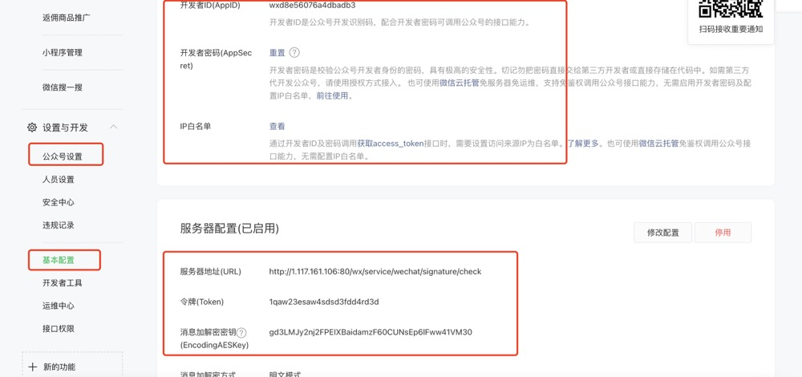

[TOC]

# 1、LOGO设计

[免费的LOGO在线设计](https://uugai.com/) 

# 2、服务器开发认证接口

[参考](http://t.csdn.cn/xHjQj)

## 1.添加依赖

```
<!--微信公众号（包括订阅号和服务号）：weixin-java-mp-->
<dependency>
  <groupId>com.github.binarywang</groupId>
  <artifactId>weixin-java-mp</artifactId>
  <version>4.3.0</version>
</dependency>
```

## 2. 浏览器登录微信公众号官网

1. 公众号设置基本信息（名称号码等等）
2. 基本配置配置服务器信息（appid、秘钥、白名单等）



## 3.接入验证

2中的服务器配置完成后点击验证，会往服务器发送一条信息，服务器下列代码会验证信息是否正确

```
    @Bean
    public WxMpService wxMpService(){
        WxMpMapConfigImpl wxMpMapConfig = new WxMpMapConfigImpl();
        wxMpMapConfig.setToken(this.getToken());
        wxMpMapConfig.setAppId(this.getAppId());
        wxMpMapConfig.setSecret(this.getSecret());
        WxMpServiceHttpClientImpl wxMpService = new WxMpServiceHttpClientImpl();
        wxMpService.setWxMpConfigStorage(wxMpMapConfig);
        return wxMpService;
    }
    
```

```
    
    @ApiOperation(value="接入-验证消息的确来自微信服务器")
    @GetMapping("/signature/check")
    public String checkSignature( ) {

        HttpServletRequest request = RequestHolder.getRequest();
        String signature = request.getParameter("signature");
        String nonce = request.getParameter("nonce");
        String timestamp = request.getParameter("timestamp");
        String echostr = request.getParameter("echostr");

        log.info("接收请求：{},{},{},{}",signature,timestamp,nonce,echostr);

        if (!this.wxMpService.checkSignature(timestamp, nonce, signature)) {
            log.error("非法请求");
            return "非法请求";
        }
        log.info("验证通过");
        return echostr;
    }
```

# 4.获取access_token

```
    @ApiOperation(value="获取Access token")
    @GetMapping("/get/token")
    public void getToken() throws WxErrorException {
        String accessToken = wxMpService.getAccessToken();
        log.info("获取token：{}",accessToken);
    }
```

# 5.获取用户列表openid

```

```

